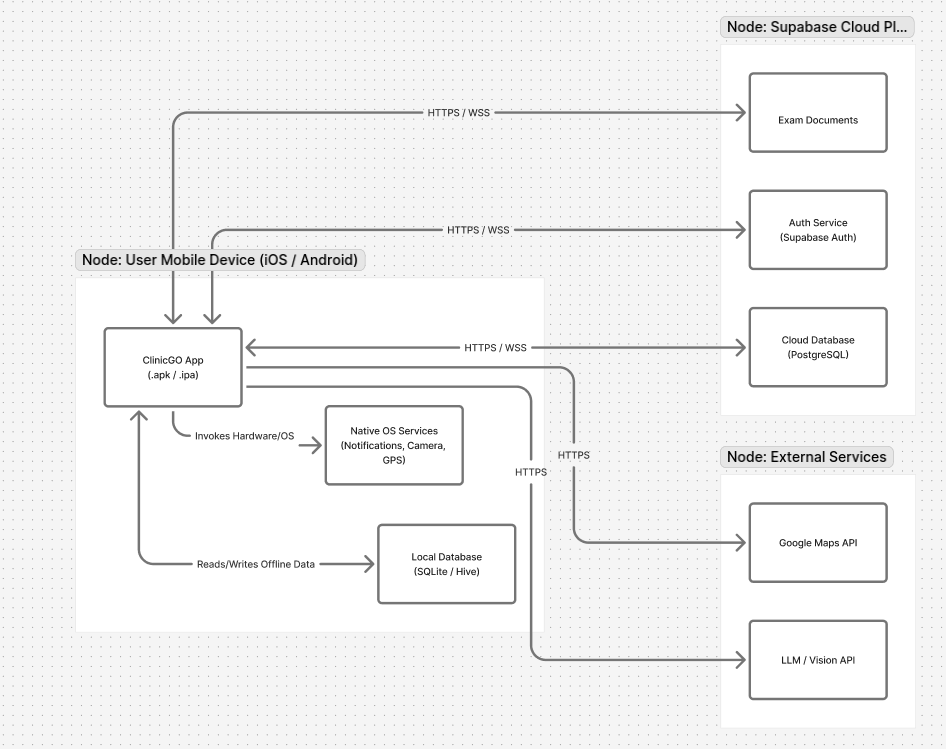
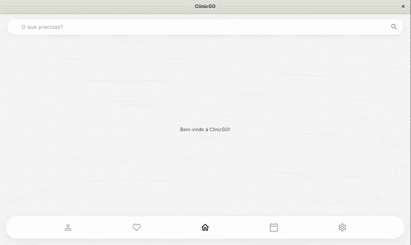
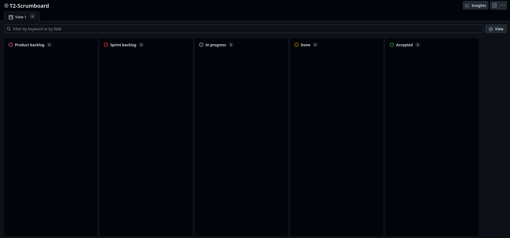
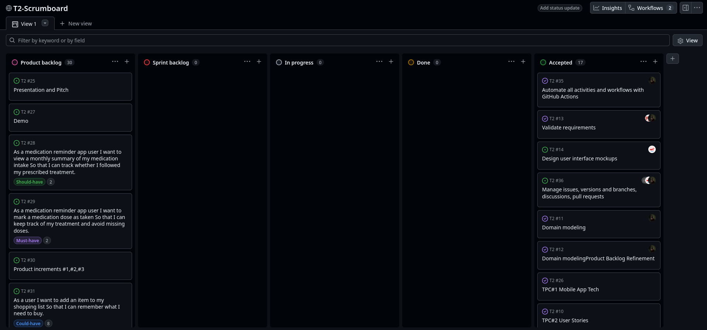

<!-- Template file for README.md for LEIC-ES-2025-26 -->

# _ClinicGO_ Development Report

Welcome to the documentation of _ClinicGO_!

This Software Development Report, tailored for LEIC-ES-2025-26, provides comprehensive details about _ClinicGO_, starting from an high-level vision and going into low-level implementation decisions. 

It is organised by the following activities: 

* [Development Environment](#Development-Environment)
  * [Prerequisites](#Prerequisites)
  * [Environment Variables](#Environment-Variables)
  * [Running the App](#Running-the-App)
  * [Running Tests](#Running-Tests)
* [Business modeling](#Business-Modelling) 
  * [Product Vision](#Product-Vision)
  * [Features and Assumptions](#Features-and-Assumptions)
* [Requirements](#Requirements)
  * [User stories](#User-stories)
  * [Domain model](#Domain-model)
  * [User interfaces](#User-interfaces)
* [Architecture and Design](#Architecture-And-Design)
  * [Logical architecture](#Logical-Architecture)
  * [Physical architecture](#Physical-Architecture)
  * [Functional prototype](#Functional-Prototype)
* [Project management](#Project-Management)
  * [Sprint 0](#Sprint-0)
  * [Sprint 1](#Sprint-1)
  * [Sprint 2](#Sprint-2)
  * [Sprint 3](#Sprint-3)
  * [Final Release](#Final-Release)

Contributions are expected to be made exclusively by the initial team, but we may open them to the community, after the course, in all areas and topics: requirements, technologies, development, experimentation, testing, etc.

Please contact us!

Thank you!


[David Ferreira](https://github.com/Dab1d)

[Guilherme Silva](https://github.com/guizas-LA)

[Tomás Silva](https://github.com/tomi-LA)

[João Maia](https://github.com/JoaooM26)  

[Pedro Meireles](https://github.com/JoaooM26)


---
## Development Environment

### Prerequisites

| Tool | Version | Purpose |
|------|---------|---------|
| [Flutter](https://docs.flutter.dev/get-started/install) | stable channel | Framework and SDK |
| [Dart](https://dart.dev/get-dart) | ≥ 3.11.3 | Bundled with Flutter |
| [Git](https://git-scm.com/) | any recent | Version control |
| Android Studio / Xcode | latest | Android / iOS targets |
| A connected device or emulator | — | Run and debug |

> **Verify your installation** with `flutter doctor`. All required items must show a green checkmark before proceeding.

### Environment Variables

The app reads credentials at runtime from a `.env` file in the project root.

1. Create `.env` by copying the template:

```bash
cp .env.example .env   # if .env.example exists, otherwise create it manually
```

2. Fill in the two required keys:

```env
NEXT_PUBLIC_SUPABASE_URL=<your-supabase-project-url>
SB_PV_KEY=<your-supabase-anon-or-service-role-key>
```

Both values can be found in the Supabase dashboard under **Project Settings → API**.

> The `.env` file is declared as a Flutter asset in `pubspec.yaml` and loaded at startup via `flutter_dotenv`. Do **not** commit it — it is (or should be) listed in `.gitignore`.

### Running the App

```bash
# 1. Clone the repository
git clone <repo-url>
cd Application

# 2. Install Dart/Flutter dependencies
flutter pub get

# 3. Launch on a connected device or emulator (debug mode)
flutter run

# 4. Target a specific platform explicitly
flutter run -d android
flutter run -d ios
flutter run -d linux
flutter run -d web
```

### Running Tests

```bash
# All widget/unit tests (no backend required)
flutter test

# With coverage report
flutter test --coverage

# Integration tests (requires a real device/emulator and a populated .env)
flutter test --dart-define-from-file=.env integration_test/app_test.dart
```

## Business Modelling

The Goal that was proposed to us for this project was creating an app that aligns with the sustainable development goals [(SDGs)](https://www.eca.europa.eu/en/sustainable-development-goals) is a meaningful and impactful way to contribute to global challenges, in a FEUP-centric setting, that may be expanded to other faculties, possibly universities.
As such, we have arrived at a central theme:
- Tracking daily medications, accessing exam results, and simplifying the process of reading medication leaflets, all within a simple and intuitive mobile app, for example.

### Product Vision

For patients who struggle to keep **track** of their medications, exam results, and clinical history, who need a **simple** and **reliable** way to manage their health information on the go, **ClinicGO** is a mobile health **companion** app that centralizes medication reminders, exam results, and medical records in **one** place. Unlike scattered paper records or generic reminder apps, our product gives patients a clear, personalized, and accessible view of their own health **anytime, anywhere**.

### The Problem

In today's fast-paced world, patients often struggle to keep **track** of their health information. Medication schedules are missed, exam results are lost in paper folders, and accessing clinical history through official portals is often slow and unintuitive. This disorganization can lead to missed doses, delayed diagnoses, and poor health outcomes. There is currently no simple, unified solution that brings all of this together in a patient-friendly way.

ClinicGO addresses this by promoting proactive health management, aligning with two key **Sustainable Development Goals**:

- **[(SDG 3)](https://www.eca.europa.eu/en/sustainable-development-goals): Good Health and Well-being** — By helping patients stay on top of their medication schedules and health records, ClinicGO contributes to better health outcomes and improved quality of life.
- **[(SDG 10)](https://www.eca.europa.eu/en/sustainable-development-goals): Reduced Inequalities** — By simplifying access to personal health information, ClinicGO makes healthcare management more accessible to all patients, regardless of digital literacy or technical background.

#### Target Audience

ClinicGO is designed for anyone who needs to actively manage their health, including:

- Patients with chronic conditions who take multiple medications daily and need reliable reminders.
- Elderly individuals or their caregivers who need a simple way to track health records and appointments.
- Young adults who want a modern, mobile-first alternative to paper prescriptions and hospital portals.
<!-- 
The vision should provide a "high concept" of the product for marketers, developers, and managers.

A product vision describes the essential of the product and sets the direction to where a product is headed, and what the product will deliver in the future. 

**We favor a catchy and concise statement, ideally one sentence.**

We suggest you use the product vision template described in the following link:
* [How To Create A Convincing Product Vision To Guide Your Team, by uxstudioteam.com](https://uxstudioteam.com/ux-blog/product-vision/)

To learn more about how to write a good product vision, please read:
* [Vision, by scrumbook.org](http://scrumbook.org/value-stream/vision.html)
* [Product Management: Product Vision, by ProductPlan](https://www.productplan.com/glossary/product-vision/)
* [20 Inspiring Vision Statement Examples (2019 Updated), by lifehack.org](https://www.lifehack.org/articles/work/20-sample-vision-statement-for-the-new-startup.html)
-->


### Features and Assumptions
<!-- 
Indicate an  initial/tentative list of high-level features - high-level capabilities or desired services of the system that are necessary to deliver benefits to the users.
 - Feature XPTO - a few words to briefly describe the feature
 - Feature ABCD - ...
...

Optionally, indicate an initial/tentative list of assumptions that you are doing about the app and dependencies of the app to other systems.
-->
#### High-level Features
- **Medication Management (Core)**: Initial setup (Add medication), editing, and deleting medications. Manual tracking ("Mark dose as taken") and visual control of pill inventory via a progress bar (Stock).
<!-- - **AI & Vision Integration**: Use of the native camera with photo preview and sharpness verification (Blur check) to send images to an LLM/Vision API (e.g., to read prescriptions or identify medication boxes). Includes an interactive Chat per medication and the mandatory presentation of a Medical Disclaimer (AI).
-->
- **Reminders & Resilient Scheduling**: Notification system for dose reminders and missed dose alerts. Includes an offline mode (Schedule) that ensures alarms trigger locally even without internet access.
- **Health Tracking**: Functionalities to log symptoms, view the user's medical history, analyze a monthly summary (Analytics), and schedule appointments.
- **Security & Authentication**: Secure Login and Logout flows managed via Supabase Auth. Includes secure profile sharing (e.g., with family members or doctors) through a temporarily generated 6-digit code.
- **Emergency & Location**: Integrated emergency alerts and a real-time map (potentially for locating on-duty pharmacies or nearby hospitals).
- **UI/UX & Navigation**: Fluid navigation based on a Bottom Navigation Bar and intuitive screen flows (e.g., Home -> Profile navigation).
- **Auxiliary Tools**: Practical day-to-day management through a Shopping list (focused on pharmacy and health supplies).

#### Assumptions

- **Local Notification Dependency**: The application relies on the mobile operating system's capability to deliver reliable and timely push notifications, ensuring reminders work consistently even offline.
<!-- - **LLM/Vision API Availability**: It is assumed that there is a reliable external API for computer vision and LLM capabilities for the AI features context.
-->
- **Supabase Integration**: The app's authentication and secure token generation rely on Supabase backend services.
- **Location Services**: Emergency alerts and map functionality assume the user grants the app proper location tracking/GPS permissions.


## Requirements

### User Stories
<!-- 
In this section you should describe all kinds of requirements for your module: functional and non-functional requirements.

For LEIC-ES-2025-26, the requirements will be gathered and documented as user stories. 

Please add in this section a concise summary of all the user stories (not each user story!).

**User stories as GitHub Project Items**
The user stories themselves should be created and described as items in your GitHub Project with the label "user story". 

A user story is a description of a desired functionality told from the perspective of the user or customer. A starting template for the description of a user story is *As a < user role >, I want < goal > so that < reason >.*

Name the item with either the full user story or a shorter name (recommended). In the “comments” field, add relevant notes, mockup images, and acceptance test scenarios, linking to the acceptance tests when available, and finally estimate value and effort.

**INVEST in good user stories**. 
You may add more details after, but the shorter and complete, the better. In order to decide if the user story is good, please follow the [INVEST guidelines](https://xp123.com/articles/invest-in-good-stories-and-smart-tasks/).

**User interface mockups**.
After the user story text, you should add a draft of the corresponding user interfaces, a simple mockup or draft, if applicable.

**Acceptance tests**.
For each user story you should write also the acceptance tests (textually in [Gherkin](https://cucumber.io/docs/gherkin/reference/)), i.e., a description of scenarios (situations) that will help to confirm that the system satisfies the requirements addressed by the user story.

**Value and effort**.
At the end, it is good to add a rough indication of the value of the user story to the customers (e.g. [MoSCoW](https://en.wikipedia.org/wiki/MoSCoW_method) method) and the team should add an estimation of the effort to implement it using points in a kind-of-a Fibonnacci scale (1,2,3,5,8,13,20,40, no idea).

-->


The following table provides a concise summary of all the user stories planned for the application. These are detailed individually in our **GitHub Project board.**

| ID         | User Story                   | Technical Justification                                          |
| :--------- | :--------------------------  | :--------------------------------------------------------------- |
| **#22**    | Bottom Navigation Bar       | Basic application routing structure.                             |
| **#28**    | Monthly Summary (Analytics) | Data aggregation and graphical visualization.                    |
| **#29**    | Mark Dose as Taken          | Simple update on the `medication_logs` table.                    |
| **#31**    | Shopping List               | Basic CRUD operations for a task list.                           |
| **#37**    | Home → Profile Navigation   | Simple state change in the router.                               |
| **#43**    | Missed Dose Notification    | Scheduled verification against dose logs.                        |
| **#44**    | Emergency Alerts            | Critical notification trigger with SMS/Email API integration.    |
| **#45/23** | Login (Supabase Auth)       | Standard authentication provider configuration.                  |
| **#46**    | Log Symptoms                | Simple form submission to the `symptoms` table.                  |
| **#47**    | Logout                      | Basic session termination implementation.                        |
| **#48**    | Schedule Appointments       | Integration with external calendar or appointment systems.       |
| **#49**    | Medical History             | Simple query with date-based filtering.                          |
| **#50**    | Real-Time Map               | Integration with a map/geolocation SDK.                          |
| **#51**    | Progress Bar (Stock)        | Simple calculations based on consumption logs.                   |
| **#52**    | Reminder Notification       | Local/remote push notification scheduling.                       |
| **#63**    | Add Medication (Setup)      | Complex CRUD with validations and business logic.                |
| **#64**    | Edit/Delete Medication      | Update/Delete operations with referential integrity constraints. |
| **#65**    | Offline Mode (Schedule)     | Local data synchronization (e.g., SQLite/WatermelonDB).          |
| **#66**    | 6-Digit Code (Sharing)      | Backend logic (RPC) and permission management.                   |
| **#67**    | Open Native Camera          | Standard hardware access and permission handling.                |
| **#68**    | Photo Preview (Blur Check)  | UI logic for real-time image validation.                         |
| **#69**    | Send to LLM/Vision API      | External API integration and image processing.                   |
| **#70**    | Medication Chat             | High complexity: message storage and querying.                   |

#### User Validation & Refinement

To ensure the **ClinicGO** application addresses real-world needs, we conducted a systematic validation phase involving potential target users. See more [here](docs/forms/validate.md)
### Domain model

<!-- 
To better understand the context of the software system, it is useful to have a simple UML class diagram with all and only the key concepts (names, attributes) and relationships involved of the problem domain addressed by your app. 
Also provide a short textual description of each concept (domain class). 

Example:
 <p align="center" justify="center">
  
</p>
-->


The ClinicGO domain is centred around the **User** (patient), who has a personal
health profile containing their name, date of birth, and contact information.
A **User** can register multiple **Medications**, each defined by a name, dosage,
frequency, and treatment period (start and end dates). Each **Medication** can have
one or more **Reminders**, which schedule notifications at specific times and on
specific days of the week to alert the patient to take their medication.

Every time a **Reminder** fires, a **MedicationLog** entry is created, recording
whether the patient took the dose or missed it, along with the timestamp. This
allows the app to track medication adherence over time.

A **User** can also store **ExamResults**, which represent clinical documents such
as blood tests or imaging results. Each exam result contains the exam type, date,
a summary, an optional file attachment, and the name of the requesting doctor.


## Architecture and Design
<!--
The architecture of a software system encompasses the set of key decisions about its organization. 

A well written architecture document is brief and reduces the amount of time it takes new programmers to a project to understand the code to feel able to make modifications and enhancements.

To document the architecture requires describing the decomposition of the system in their parts (high-level components) and the key behaviors and collaborations between them. 

In this section you should start by briefly describing the components of the project and their interrelations. You should describe how you solved typical problems you may have encountered, pointing to well-known architectural and design patterns, if applicable.
-->


### Logical architecture
<!--
The purpose of this subsection is to document the high-level logical structure of the code (Logical View), using a UML diagram with logical packages, without the worry of allocating to components, processes or machines.

It can be beneficial to present the system in a horizontal decomposition, defining layers and implementation concepts, such as the user interface, business logic and concepts.
alvaroltor
Example of _UML package diagram_ showing a _logical view_ of the Eletronic Ticketing System (to be accompanied by a short description of each package):


-->
<div align="center" justify="center">
  

</div>
<br>
The logical architecture represents the high-level structure of the ClinicGO application, illustrating 
the main feature modules and their internal interactions based on the Model-View-ViewModel (MVVM) 
pattern. Each component's declarative UI (View) is strictly decoupled from data processing; 
it interacts solely with its corresponding presentation logic (ViewModel). This logic, in turn,
communicates with the core Domain Entities and Repositories. These repositories are linked to Supabase
for secure user authentication and cloud data storage, as well as to Local Storage to ensure offline 
functionality for critical features like medication reminders. For specific external integrations, 
the system relies on the Google Maps API to fetch and display real-time map data, and an LLM/Vision 
API to process images of prescriptions and medication boxes.

### Physical architecture
<!--
The goal of this subsection is to document the high-level physical structure of the software system (machines, connections, software components installed, and their dependencies) using UML deployment diagrams (Deployment View) or component diagrams (Implementation View), separate or integrated, showing the physical structure of the system.

It should describe also the technologies considered and justify the selections made. Examples of technologies relevant for ESOF are, for example, frameworks for mobile applications (such as Flutter).

Example of _UML deployment diagram_ showing a _deployment view_ of the Eletronic Ticketing System (please notice that, instead of software components, one should represent their physical/executable manifestations for deployment, called artifacts in UML; the diagram should be accompanied by a short description of each node and artifact):


-->

The physical architecture outlines the main components of the ClinicGO application, illustrating 
not only how they connect with one another but also how they interact with external APIs and native 
hardware. Our application's core business logic and authentication features depend directly on Supabase
(PostgreSQL and Supabase Auth) to securely store, retrieve, and sync cloud data.
<br>
The application logic also communicates seamlessly with native OS capabilities, such as the device
camera for prescription scanning and the notification manager for local medication alerts. To guarantee our 
critical Offline Mode, a Local Storage solution (such as SQLite or Hive) is responsible for saving and retrieving 
schedule data directly on the user's device. Finally, the location services depend on the Google Maps API to
retrieve relevant geolocation data, while an external LLM/Vision API is utilized to process and analyze images of
medication boxes and clinical documents.

### Functional prototype
<!--
To help on validating all the architectural, design and technological decisions made, we usually implement a functional prototype, a thin vertical slice of the system integrating as much technologies as we can.

In this subsection please describe which feature, or part of it, you have implemented, and how, together with a snapshot of the user interface, if applicable.

At this phase, instead of a complete user story, you can simply implement a small part of a feature that demonstrates thay you can use the technology, for example, show a screen with the app credits (name and authors).
-->
To validate our architectural decisions and technology stack, we implemented a thin vertical slice of the ClinicGO application focused on Core Navigation and UI Structure.

We developed the foundational application skeleton using Flutter. This prototype successfully demonstrates the implementation of the primary routing architecture anchored on a BottomNavigationBar (addressing User Story #22). It showcases the dynamic state changes required to switch seamlessly between the main functional modules of the application (Profile, Health/Favorites, Home, Schedule, and Settings).

This prototype proves that our Flutter development environment is fully operational, cross-platform compilation is working properly, and the base View layer is structurally ready to be decoupled and connected to our ViewModels.

Below is an animated snapshot of the functional prototype in action:
<br>
<div align="center" justify="center">

</div>

## Project management
<!--
Software project management is the art and science of planning and leading software projects, in which they are planned, implemented, monitored and controlled.

In the context of ESOF, we recommend each team to adopt a set of project management practices and tools capable of registering tasks, assigning tasks to team members, adding estimations to tasks, monitor tasks progress, and therefore being able to track their projects.

Common practices of managing agile software development with Scrum are: backlog management, release management, estimation, Sprint planning, Sprint development, acceptance tests, and Sprint retrospectives.

You can find below information and references related with the project management: 

* Backlog management: Product backlog and Sprint backlog in a [Github Projects board](https://github.com/orgs/FEUP-LEIC-ES-2023-24/projects/64);
* Release management: [v0](#), v1, v2, v3, ...;
* Sprint planning and retrospectives: 
  * plans: screenshots of Github Projects board at begin and end of each Sprint;
  * retrospectives: meeting notes in a document in the repository, addressing the following questions:
    * Did well: things we did well and should continue;
    * Do differently: things we should do differently and how;
    * Puzzles: things we don’t know yet if they are right or wrong;
    * list of a few improvements to implement next Sprint;

-->
***

You can find below information and references related to the project management practices and tools utilized by our team:

* **Backlog Management:** Both the Product Backlog and Sprint Backlog are actively managed within our GitHub Projects Board.
* * **Release Management:** Version tracking begins with [v0](https://github.com/LEIC-ES-2025-26-2LEIC07/T2/releases/tag/v0), followed by v1, v2, v3...
* **Sprint Planning & Retrospectives:** Planning and retrospective documentation is maintained for Sprint 0, Sprint 1, Sprint 2, Sprint 3, and the Final Release.
* **Happiness Meters:** We track team morale using a [Happiness Meter](https://docs.google.com/spreadsheets/d/1Dd4dCzsbW1eqSfxNmsqDLT0UyNPI31Aicefy5qclR7k/edit?usp=sharing). Each member fills out the column associated with their designated number (e.g., member M3 fills the third column).
* **Changelog:** We maintain a detailed changelog to track important changes in each released version. This follows the standard format specified at [Chanellog](CHANGELOG.md)).
* **Git Workflow:** We follow a feature-branch workflow branching off `main`. Each feature or bug fix is developed on its own dedicated branch and integrated via a Pull Request (PR). Code reviews are mandatory and enforced using branch protection rules to ensure code quality and consistency.
* **CI/CD (GitHub Actions):** Every Pull Request automatically triggers a GitHub Actions workflow that verifies code formatting and enforces linting rules. This helps maintain a consistent codebase and prevents errors from reaching the main branch.

### Sprint 0

<div align="center" justify="center">
  <p>Start of Sprint 0</p>
  
  <p>End of Sprint 0</p>
  
</div>

#### Sprint 0 Review

Sprint 0 was demonstrated to the TP teacher and the full team. Key deliverables shown:

- Product vision statement defining ClinicGO’s value proposition for medication management.
- Domain model covering core entities (User, Medication, Dose, Reminder, Symptom).
- Initial Product Backlog with user stories sized and prioritized for Sprint 1.
- High-level MVVM architecture design with Supabase as the backend.
- v0 prototype: bottom navigation shell, profile screen stub, Supabase auth configuration, and routing foundations.

Feedback: product vision was clear and well-scoped. Architecture choice was validated and the AI-generated images need to be changed.

#### Sprint 0 Retrospective

* **Did well:**
    * **Product Definition:** Established a clear product vision and well-defined user stories for ClinicGO.
    * **Architecture Foundation:** Correctly organized the app’s structural foundations using the **MVVM pattern** and integrated **Supabase** as backend from the start.
    * **Tooling:** Initial setup of the GitHub Scrum board provided effective tracking of backlog items and sprint progress.

* **Do differently:**
    * **Team Balance & Participation:** The vast majority of Sprint 0 work was carried out by only a few members. Workload distribution needs to be more equitable to avoid bottlenecks and knowledge silos.
    * **Time Management:** Work was concentrated at the end of the sprint. Starting iterations immediately would reduce end-of-sprint crunch and leave time for unexpected technical issues.
    * **Git Workflow:** Feature branches and pull requests were not consistently used. Enforcing this from the start would improve code review visibility and quality.

* **Improvements for Sprint 1:**
    * All tasks in the Sprint Backlog must be assigned to a team member at planning time — no unassigned items by day 2 of the sprint.
    * Every code change goes through a PR with at least one reviewer before merging to `main`.
    * Schedule a mid-sprint sync (async check-in on Slack/Discord) to surface blockers early.


### Sprint 1

<div align="center" justify="center">

  <p>Start of Sprint 1</p>

  <p>End of Sprint 1</p>
</div>

#### Sprint 1 Review

Sprint 1 was demonstrated to the TP teacher and the full team. Key deliverables shown:

- Medication management: add medications with dosage, frequency, and reminder time.
- Dose tracking: mark individual doses as taken or skipped from the home screen.
- Login and registration screens with Supabase authentication and session persistence.
- v0.1 GitHub release with APK and CHANGELOG.

Feedback: core medication flow was working end-to-end. Suggestion to improve test coverage and reinforce PR-based workflow across the whole team for Sprint 2.

#### Sprint 1 Retrospective

* **Did well:**
    * **Core Feature Delivery:** All main user stories planned for the sprint were completed — medication CRUD, notification scheduling, and dose tracking all working end-to-end.
    * **Supabase Integration:** Authentication and data persistence via Supabase were successfully integrated, unblocking future feature development.
    * **First Release:** v0.1 shipped on time with a working APK and CHANGELOG.

* **Do differently:**
    * **End-of-Sprint Pressure:** Several features were finalized in the final 24 hours, leaving no time for integration testing or refinement. Work needs to start earlier.
    * **Git Workflow Consistency:** Not all team members consistently used feature branches and PRs, causing integration conflicts and reducing code review coverage.
    * **Test Coverage:** Unit and integration tests were minimal this sprint. Automated tests should be written alongside features, not as an afterthought.

* **Improvements for Sprint 2:**
    * Each team member picks up their Sprint Backlog item by day 1 and opens a draft PR by day 3 — this surfaces integration issues early.
    * Mandatory PR review by at least one other team member before any merge to `main`.
    * Every new feature includes at least one unit or widget test before the PR is marked ready.


### Sprint 2

<div align="center" justify="center">

  <p>Start of Sprint 2</p>

  <p>End of Sprint 2</p>
</div>

#### Sprint 2 Review

Sprint 2 was demonstrated to the TP teacher and the full team. Key deliverables shown:

- Monthly medication summary allowing users to review their intake history over time.
- Calendar schedule view showing past and upcoming medication doses by day.
- Symptom logging flow so users can record symptoms and help doctors track health changes.
- Profile update flow for managing personal information and preferences.
- Daily doses view with take/skip actions from the home screen.
- Expanded automated test suite covering authentication, medications, calendar, and profile flows.
- v0.2 GitHub release with APK and CHANGELOG.

Feedback: significant feature expansion delivered.

#### Sprint 2 Retrospective

* **Did well:**
    * **Peer Review Culture:** Mandatory PRs were adopted by the full team. Active code reviews led to fewer integration bugs and a more consistent coding style.
    * **Feature Scope:** All planned user stories were delivered, expanding the app from basic medication CRUD to a full daily management flow.

* **Do differently:**
    * **Persistent End-of-Sprint Crunch:** Tasks were again backloaded to the final days, preventing thorough testing of the last features before the deadline.
    * **Delayed Problem Signaling:** Without scheduled sync sessions, technical blockers were kept private too long, creating unnecessary bottlenecks.

* **Improvements for Sprint 3:**
    * Implement one weekly 60-minute sync session for progress alignment and early blocker resolution.
    * Integration tests must be updated in the same PR as any UI change — broken tests block merge.

### Sprint 3

<div align="center" justify="center">

  <p>Start of Sprint 3</p>

  <p>End of Sprint 3</p>
</div>

#### Sprint 3 Review

Sprint 3 was demonstrated to the TP teacher and the full team. Key deliverables shown:

- Neo-brutalist visual redesign applied to the profile, medications list, add medication, edit medication, and login/register screens, delivering a cohesive design system ahead of Pitch & Demo.
- Symptom history view allowing users to review previously logged symptoms.
- Splash screen with ClinicGO branding shown on app launch.
- Notification lifecycle management with runtime permission handling and dose reminder scheduling.
- Expanded automated test suite covering add medication, edit/delete medication, and register user journeys.
- Avatar photo upload from gallery for profile customisation.

Feedback: overall positive on visual consistency and test coverage. Suggestion to close remaining open MUST HAVE Users Stories about notifications.

#### Sprint 3 Retrospective

* **Did well:**
    * **CI/CD improvement:** Targeted test runs on PRs and full suite on merge to `main`, with PR comment reporting test results.
    * **Visual consistency:** The neo-brutalist design system was applied uniformly across all redesigned screens, significantly improving the app's visual identity with no hardcoded colours — all tokens via `AppColors`.

* **Do differently:**
    * **Sprint planning quality:** One epic (#102) was in the Sprint Backlog at planning time, and #105 had no Effort estimate — both violations caught and fixed mid-sprint. These should be caught at kickoff.

* **Improvements for next sprint:**
    * At sprint planning, verify no epics in the Sprint Backlog, all items have Effort estimates, and total effort does not exceed the previous sprint's velocity.
    * Set a PR review deadline of 48 hours before sprint end to avoid last-minute merges.

### Sprint 4

<div align="center" justify="center">
  <p>Start of Sprint 4</p>
  
  <p>End of Sprint 4</p>
  
</div>

#### Sprint 4 Review

Sprint 4 was the final sprint before the Demo and Pitch. Key deliverables shown:

- **Emergency Alerts** with Firebase Cloud Messaging (FCM): server-triggered push notifications delivered to registered devices when a critical health alert is raised, with an in-app banner overlay and detail screen.
- **Server-side medication reminders**: a Supabase Edge Function (`send-medication-reminders`) triggered every minute by pg_cron replaces all client-side `flutter_local_notifications` scheduling. This resolves the `SCHEDULE_EXACT_ALARM` permission issue on Android 12+ and ensures reminders fire even when the app is closed.
- **Calendar screen redesign**: neo-brutalist style with a real-time dose status panel. Calendar days now update immediately after a medication is created or a dose is logged.
- **Settings page**: functional notifications toggle that reads the real system permission state, persists the user preference via `SharedPreferences`, and suppresses foreground notifications when disabled.
- **Bug fixes**: notification not dismissed after logging a dose (notification ID mismatch), floating navbar hidden behind Android system navigation bar, Kotlin Gradle Plugin migration, P0 calendar deduplication bug.
- **UI polish**: splash screen with ClinicGO branding, Portuguese auth screens fully restored, navbar labels translated to Portuguese, symptom logging screen improved.
- **Test suite**: UAT integration tests added for US02, US04, US07 journeys; high-priority unit tests added for `EditMedicationViewModel` and `EditMedicationScreen`.
- **CI/CD**: upgraded to Node.js 24 for GitHub Actions; CodeQL workflow fixed.

#### Sprint 4 Retrospective

* **Did well:**
    * **Architectural problem-solving:** When local notifications proved unreliable on real Android devices, the team identified the root cause and solved it at the infrastructure level (moving to server-side FCM) rather than applying a fragile local fix.
    * **PR workflow:** All work was delivered through PRs with code review, keeping `main` consistently stable throughout the sprint.
    * **End-to-end verification:** The notification pipeline was verified live on a real device (pg_cron → Edge Function → FCM → push received), confirming the architectural change was correct.

* **Do differently:**
    * **Notification testing on real hardware sooner:** The incompatibility between `SCHEDULE_EXACT_ALARM` and OEM battery management was only discovered late in development, after testing on an emulator. Testing on a real device from Sprint 2 would have surfaced this earlier.
    * **Infrastructure setup documentation:** The Firebase service account key and Supabase pg_cron setup required manual steps not captured in the repo. These should be documented in a `SETUP.md` for future maintainers.

* **Improvements for the future:**
    * Document all external service secrets and manual setup steps in a dedicated `SETUP.md` file.
    * Add a Supabase Edge Function test harness to validate `send-medication-reminders` locally before deploying.

### Final Release

<div align="center" justify="center">
  <p>Start of Final Release</p>
  
  <p>End of Final Release</p>
  
</div>

#### Final Release Review

The final release consolidates all work delivered across Sprint 0–4 into a stable, shippable version of ClinicGO. Key deliverables presented at Demo & Pitch:

- Full medication management lifecycle: add, edit, delete medications with dosage, frequency, colour coding, and reminder scheduling.
- Server-side push notification delivery via Supabase Edge Function + Firebase FCM, replacing unreliable client-side local scheduling and working even when the app is closed.
- Emergency alerts pipeline: server-triggered FCM push notifications with in-app banner overlay and detail screen.
- Calendar view with daily dose status updated in real time.
- Symptom logging and monthly summary.
- Profile with avatar upload, settings page with functional notification toggle.
- Neo-brutalist design system applied consistently across all screens.
- Automated test suite covering unit, widget, and UAT integration journeys.
- GitHub Actions CI running on every PR.

#### Final Release Retrospective

* **Did well:**
    * **End-to-end delivery:** All core user stories were implemented and working on a real device by the final demo — medication reminders, emergency alerts, dose tracking, and calendar all functional.
    * **Architecture resilience:** When a core feature (local notifications) proved unreliable on real Android hardware, the team pivoted to a server-side solution that is more robust and platform-independent.
    * **Design consistency:** The neo-brutalist design system gave the app a distinctive, cohesive visual identity that held across all screens without hardcoded values.
    * **AI-assisted development:** The `[MISTER AI]` convention provided full traceability of AI contributions across all sprints, enabling honest reporting of human vs. AI authorship.

* **Do differently:**
    * **Test on real hardware earlier:** Several issues (exact alarm permissions, OEM battery management, USB device recognition) only surfaced when testing on physical devices late in development.
    * **Infrastructure setup documented from the start:** Firebase service account keys, Supabase pg_cron, and Edge Function secrets required manual setup steps that were not captured in the repo until the end.
    * **More equitable workload distribution:** Some sprints had uneven contribution across team members; better upfront task assignment at planning would have balanced this.

* **What we would do next:**
    * Implement offline mode with local SQLite cache for dose tracking without internet.
    * Add AI/Vision integration for prescription scanning.
    * Publish to the Google Play Store.

---

ClinicGO's final release delivers a complete medication management companion for Android. The full feature set across all four sprints includes:

| Feature | Status |
|---------|--------|
| Medication CRUD (add, edit, delete) with dosage, frequency, and colour coding | ✅ |
| Dose tracking — mark as taken or skipped from home screen | ✅ |
| Server-side medication reminders via Supabase Edge Function + Firebase FCM | ✅ |
| Emergency alerts with FCM push notifications and in-app banner | ✅ |
| Monthly calendar with daily dose status (green = all taken, orange = partial) | ✅ |
| Symptom logging and history view | ✅ |
| Profile management with avatar upload (Supabase Storage) | ✅ |
| Settings page with notification preference toggle | ✅ |
| Supabase Auth — login, register, logout with session persistence | ✅ |
| Neo-brutalist design system applied consistently across all screens | ✅ |
| Splash screen with ClinicGO branding | ✅ |
| GitHub Actions CI — linting, formatting, unit + widget tests on every PR | ✅ |
| UAT acceptance tests for core user journeys | ✅ |

The final APK is available in the [GitHub Releases](https://github.com/LEIC-ES-2025-26-2LEIC07/T2/releases) page.

**AI Convention:** All AI-generated commits across the project are prefixed `[MISTER AI]`. Full AI usage reports per sprint are available in [`docs/ai_report/`](docs/ai_report/).
