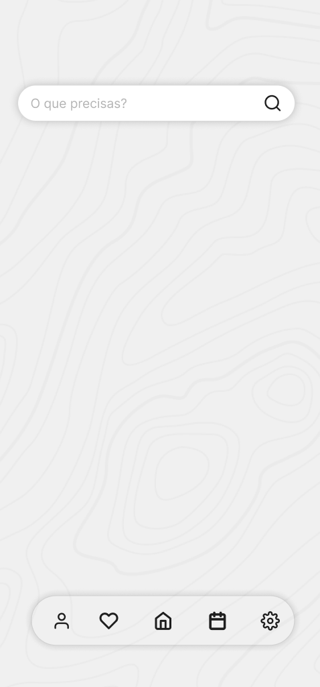

# 4U Development Report

Welcome to the documentation pages of the 4U App!

You can find here detailed about 4U , hereby mentioned as module, from a high-level vision to low-level implementation decisions, a kind of Software Development Report , organized by discipline (as of RUP):

* Business modeling 
  * [Product Vision](#Product-Vision)
* Requirements
  * [User stories](#User-stories)
* Architecture and Design

Please contact us!

Thank you!

[David Ferreira](https://github.com/Dab1d)

[Guilherme Silva](https://github.com/guizas-LA)

[Tomás Silva](https://github.com/tomi-LA)

[João Maia](https://github.com/JoaooM26)  

[Pedro Meireles](https://github.com/JoaooM26)


----

## Product Vision
To pioneer a future where health is never a second thought, by turning daily habits into lifelong vitality through intelligent tracking and intuitive care.

----
## User Stories


### Story #1
As a user I want to be able to rate a talk so that other users can evaluate the talk's quality

### User interface mock-up
<p align="center">
  
</p>

##### Button to leave a rating


##### Screen where the user can actually leave the rating


### Acceptance tests
```Gherkin
Scenario: Rate a talk.
  Given The post of a talk that I have attended
  When I tap "Rate talk"
  And I insert a rate
  And I tap "OK",
  Then the talk's post appears
```

### Value and effort
* Value: Must have
* Effort: XL

### Story #2
As a user I want to be able to leave a comment about the talk so that I can give feedback to the speakers and organizers

### User interface mock-up
<p align="center">
  
</p>

##### Button to leave a comment


##### Screen where the user can actually leave the comment


### Acceptance tests
```Gherkin
Scenario: Leave a comment about a talk
  Given A talk's post that I have attended and rated
  When I tap "Leave a comment"
  And I tap "Comment"
  And I write "Hey that was great!"
  And I tap "Leave Comment"
  And I tap "See all comments"
  Then my comment appears
```
### Value and effort
* Value: Must have
* Effort: XL


### Story #3
As a user I want to be able to see the current rating of a talk so that I can make the decision if I want to attend it

### User interface mock-up


### Acceptance tests
```Gherkin
Scenario: See rating of a talk
  Given A talk's post that is presented in the feed
  When I am in the talk's post
  Then the current rating appears
```

### Value and effort
* Value: Must have
* Effort: M


