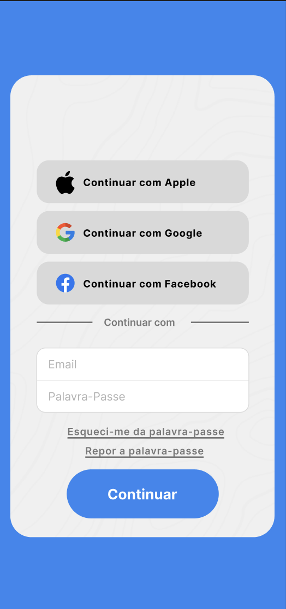

# 4U Development Report

Welcome to the documentation pages of the 4U App!

You can find here detailed about 4U , hereby mentioned as module, from a high-level vision to low-level implementation decisions, a kind of Software Development Report , organized by discipline (as of RUP):

* Business modeling 
  * [Product Vision](#Product-Vision)
* Requirements
  * [User stories](#User-stories)
* Architecture and Design

Please contact us!

Thank you!

[David Ferreira](https://github.com/Dab1d)

[Guilherme Silva](https://github.com/guizas-LA)

[Tomás Silva](https://github.com/tomi-LA)

[João Maia](https://github.com/JoaooM26)  

[Pedro Meireles](https://github.com/JoaooM26)


----

## Product Vision
To pioneer a future where health is never a second thought, by turning daily habits into lifelong vitality through intelligent tracking and intuitive care.

----
## User Stories


### Story #1
As an app user,
I want to log into my account using my email and password,
So that I can access my personalized profile, settings, and private data.

### User interface mock-up
<p align="center">
  
</p>

### Acceptance tests
```Gherkin
Scenario: Successful Login
  Given the user is on the login screen
  When the user enters a valid email but an incorrect password
  And the user taps the "Log In" button
  Then the system should deny access
  And the system should display an error message stating "Invalid credentials"
  And the system should empty the password input field for a retry.
```

### Value and effort
* Value: Must have
* Effort: XL

### Story #2
As an app user,
I want to use a bottom navigation bar,
So that I can easily switch between the core sections of the 4U app without
losing my place or context.

### User interface mock-up
<p align="center">
  
</p>


### Acceptance tests
```Gherkin
Scenario: Switching between primary tabs
  Given the user is viewing the "Home" screen
  When the user taps the "Me" (Profile) icon in the navigation bar
  Then the system should display the Profile screen
  And the system should visually update the navigation bar to show "Me" as the active tab.
```
### Value and effort
* Value: Must have
* Effort: XL


### Story #3
As a user I want to be able to see the current rating of a talk so that I can make the decision if I want to attend it

### User interface mock-up


### Acceptance tests
```Gherkin
Scenario: See rating of a talk
  Given A talk's post that is presented in the feed
  When I am in the talk's post
  Then the current rating appears
```

### Value and effort
* Value: Must have
* Effort: M


