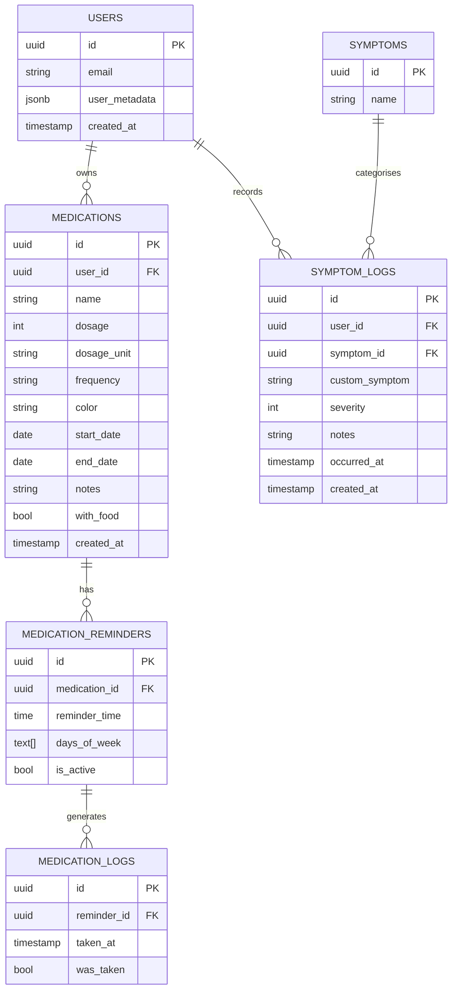
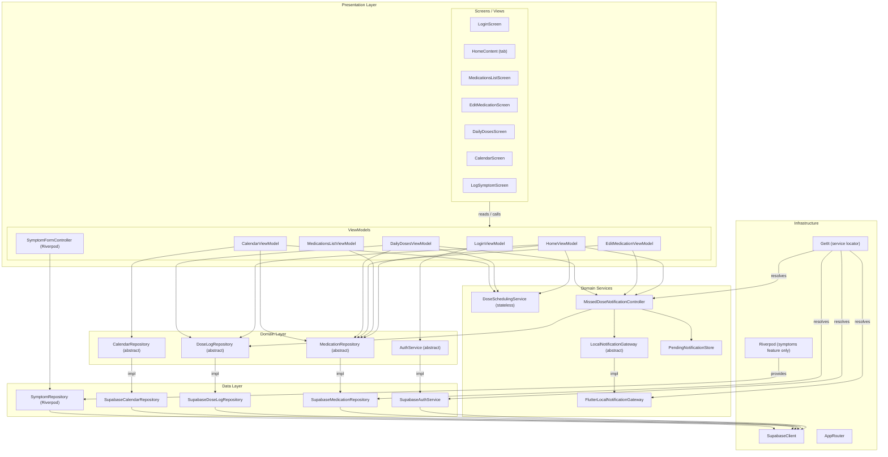

# ClinicGO — Automated Code Review

> Generated: 2026-05-20 | Branch: `notification` | 4 parallel review agents (A: business logic, B: tests, C: CI, D: schema/architecture)

---

## Executive Summary

| Priority | Count | Status |
|----------|-------|--------|
| P0 — Critical | 2 | 1 fixed in this PR, 1 partially mitigated |
| P1 — Important | 7 | 3 fixed in this PR |
| P2 — Minor | 14 | 2 fixed in this PR |

**Test suite:** regressed to **9 failures** on the `notification` branch — all fixed in this PR.
**Architecture:** solid layering; two DI systems (GetIt + Riverpod) coexist by feature.
**Schema:** no SQL migration files in-repo; schema lives in Supabase cloud only — see gap below.

---

## P0 — Critical

### [FIXED] Calendar deduplication always fails
**File:** `lib/features/calendar/presentation/view_models/calendar_view_model.dart:133`

`loggedReminderIds` contains reminder UUIDs. `ScheduledDose.id` is a composite `reminderId_epochSeconds` string. The `contains` check never matches — every scheduled dose appears alongside its logged counterpart, doubling the count in the calendar view.

**Fix applied:** Extract the reminder ID from `s.id` before comparing:
```dart
// before
if (loggedReminderIds.contains(s.id)) continue;
// after
if (loggedReminderIds.contains(s.id.substring(0, s.id.lastIndexOf('_')))) continue;
```

---

### [MITIGATED] CI secrets echoed through shell variables
**File:** `.github/workflows/ci.yml:200-206`

`SUPABASE_URL` / `SUPABASE_KEY` were stored in `env:` then echoed via shell variables (`$SUPABASE_URL`). Shell variable expansion bypasses GitHub Actions' automatic secret masking, making values visible in build logs on failure.

**Fix applied:** Removed the `env:` block; secrets referenced directly via `${{ secrets.X }}` expressions in the `run` command, which Actions masks correctly.

**Remaining risk:** `--dart-define` embeds values in the compiled binary — consider `--dart-define-from-file` with a temp JSON file for defence-in-depth.

---

## P1 — Important

### [FIXED] 9 failing tests: `LocalNotificationGateway` not registered in test setUp
**File:** `test/main_test.dart:54` (setUp)

`NotificationLifecycleWrapper` (added in commit `10cac1e`) calls `getIt<LocalNotificationGateway>()` in `initState`, but the test setUp only registered `MissedDoseNotificationController`, not the gateway. This corrupted the widget tree before the nav bar was stable, causing all 9 profile-tab tests to fail with `find.text('PROFILE')` returning 0 widgets.

**Fix applied:**
```dart
GetIt.I.registerSingleton<LocalNotificationGateway>(notificationGateway);
```

---

### [FIXED] Missing pub cache in CI — re-downloads all deps every run
**File:** `.github/workflows/ci.yml`

`subosito/flutter-action` with `cache: true` only caches the Flutter SDK. `~/.pub-cache` was not cached, adding 1–3 minutes per run.

**Fix applied:** Added `actions/cache@v4` for `~/.pub-cache` keyed on `pubspec.lock` hash to both jobs.

---

### [NOT FIXED] Silent catch swallows profile update failure on sign-up
**File:** `lib/features/auth/presentation/view_models/sign_up_view_model.dart:68`

```dart
try {
  await _auth.updateProfile(...);
} catch (_) {}  // silently ignored — user marked successful with incomplete metadata
_success = true;
```

If `updateProfile` fails (network error, auth error), user metadata (name, phone, birth date) is lost silently. The account is marked created but is incomplete.

**Recommended fix:** At minimum log the error and surface a non-blocking warning to the user:
```dart
} catch (e) {
  debugPrint('Profile metadata save failed: $e');
  // optionally: set a _metadataWarning flag to show a toast
}
```

---

### [NOT FIXED] Unguarded `int.parse()` on untrusted data — 4 locations
Crashes on any malformed dose ID or time string from the database.

| File | Line | Issue |
|------|------|-------|
| `lib/features/medication/data/supabase_dose_log_repository.dart` | 45 | `int.parse(doseId.substring(lastUnderscore + 1))` |
| `lib/features/medication/services/dose_scheduling_service.dart` | 27 | `int.parse(timeParts[0])` after length check |
| `lib/features/medication/presentation/view_models/edit_medication_view_model.dart` | 60 | `int.parse(parts[0])` |
| `lib/features/medication/models/medication.dart` | 79 | `int.parse('FF$cleaned', radix: 16)` |

**Recommended fix:** Replace with `int.tryParse()` and handle `null` gracefully at each callsite.

---

### [NOT FIXED] `NotificationLifecycleWrapper` has zero tests
**File:** `lib/core/widgets/notification_lifecycle_wrapper.dart`

This is the new feature on the `notification` branch: it contains `initState` side-effects, auth stream subscription, permission banner logic, and `didChangeAppLifecycleState` handler. None of this is tested.

**Recommended fix:** Add widget tests covering:
1. Permission denied → `MaterialBanner` with warning text appears
2. Tapping DISMISS hides the banner
3. App resume → `onAppResumed()` called on controller

---

### [NOT FIXED] `EditMedicationViewModel` has zero tests
**File:** `lib/features/medication/presentation/view_models/edit_medication_view_model.dart`

Contains significant logic: `loadReminders`, `setFrequency`, `_syncReminderSlots`, `submit`, `deleteMedication`. Nothing is tested.

---

## P2 — Minor

### [FIXED] Unguarded `days_of_week` cast crashes on missing DB column
**File:** `lib/features/medication/models/medication_reminder.dart:34`

```dart
// before — crashes if column is null or missing
daysOfWeek: (json['days_of_week'] as List<dynamic>).cast<String>(),
// after — defaults to empty list
daysOfWeek: (json['days_of_week'] as List<dynamic>?)?.cast<String>() ?? [],
```

---

### [NOT FIXED] Duplicate dose-logging logic in two ViewModels (DRY / SRP)
**Files:** `lib/features/home/presentation/view_models/home_view_model.dart:77` and `lib/features/medication/presentation/view_models/daily_doses_view_model.dart:127`

Identical "use notification controller if available, else fallback to repository" logic duplicated in both. Extract to a `DoseLoggingService` or a decorator around `DoseLogRepository`.

---

### [NOT FIXED] Null medication name/dosage renders as string `"null"` in calendar UI
**File:** `lib/features/calendar/data/supabase_calendar_repository.dart:124`

```dart
medicationName: med['name']?.toString(),   // null → "null"
dosage: med['dosage']?.toString(),         // null → "null"
```

Use `med['name'] as String?` and fall back explicitly: `?? 'Unknown'`.

---

### [NOT FIXED] `expect()` on un-awaited Future in pending notification store test
**File:** `test/features/medication/services/pending_notification_store_test.dart:65`

```dart
expect(() => store.loadPending(), throwsA(anything));  // should be expectLater
```

---

### [NOT FIXED] `DateTime.now()` without injection in two test files
**Files:**
- `test/features/medication/services/dose_scheduling_service_test.dart:112`
- `test/features/medication/presentation/view_models/daily_doses_view_model_test.dart:51`

Tests use `DateTime.now()` for scheduled times; can fail at day boundaries. Inject a fixed clock.

---

### [NOT FIXED] Flutter SDK version not pinned in CI
**File:** `.github/workflows/ci.yml` (both jobs)

`channel: stable` floats. Pin to a specific version for reproducible builds:
```yaml
flutter-version: '3.32.0'
channel: stable
```

---

### [NOT FIXED] No SQL migration files in the repository
Schema lives entirely in Supabase cloud. If the project is cloned to a new org or local Supabase, there is no way to recreate the schema. Add migration files under `supabase/migrations/`.

---

### [NOT FIXED] `medication_logs` has no `user_id` column
User scoping relies entirely on RLS join through `medication_reminders → medications.user_id`. If RLS is ever misconfigured or bypassed, all users' logs are accessible. Document this explicitly and consider adding `user_id` as a denormalized column with a CHECK constraint.

---

### [NOT FIXED] Inconsistent error mapping in auth service
**File:** `lib/features/auth/data/supabase_auth_service.dart:56-79`

`updateProfile` maps Supabase errors to `AuthException`; `signIn`, `signUp`, `resetPassword` throw raw Supabase exceptions. Callers must catch two different types for the same service.

---

### [NOT FIXED] No-op `catch (_) { rethrow; }` pattern
**File:** `lib/features/medication/presentation/view_models/medications_list_view_model.dart:39`

The catch block adds no value. Remove it or add logging.

---

### [NOT FIXED] Broad catch masks errors in `EditMedicationViewModel.loadReminders`
**File:** `lib/features/medication/presentation/view_models/edit_medication_view_model.dart:73`

Network, parse, and DB errors all fall into the same silent fallback to a default reminder slot. Add `debugPrint` at minimum.

---

## Architecture Diagrams

### ER Diagram



> Note: `medication_logs` has no `user_id` — user scope enforced via RLS join only.
> Figma ER diagram: pending (requires manual creation in Figma).

---

### App Architecture



---

## Applied Fixes Summary

| Fix | Files Changed |
|-----|--------------|
| P0 — Calendar deduplication: extract reminder ID before comparing | `lib/features/calendar/presentation/view_models/calendar_view_model.dart` |
| P0 — CI secrets: remove env-var echo pattern, use `${{ secrets.X }}` directly | `.github/workflows/ci.yml` |
| P1 — Test failures: register `LocalNotificationGateway` in test setUp | `test/main_test.dart` |
| P1 — CI: add `actions/cache@v4` for `~/.pub-cache` in both jobs | `.github/workflows/ci.yml` |
| P2 — `days_of_week` null cast: guard with `as List<dynamic>?` + `?? []` | `lib/features/medication/models/medication_reminder.dart` |

---

## Recommended Next Actions

1. **This PR** — apply and verify the 5 fixes above; re-run full test suite
2. **Next PR** — fix all `int.parse()` callsites (4 files); guard `days_of_week`-like fields
3. **Sprint work** — add tests for `NotificationLifecycleWrapper` and `EditMedicationViewModel`
4. **Tech debt** — extract `DoseLoggingService`; unify DI (GetIt vs Riverpod); add SQL migrations
5. **Security** — add `user_id` to `medication_logs` or document the RLS-join assumption explicitly
