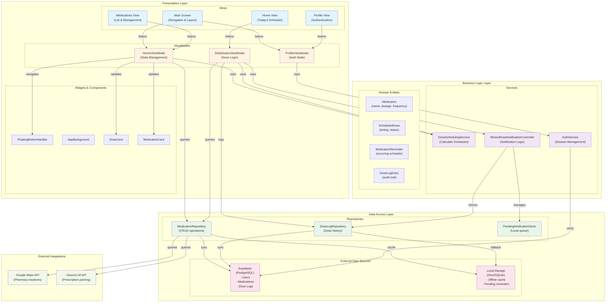

# ClinicGO Logical View (MVVM Architecture)

## UML Package Diagram

## Architecture Description

### **Presentation Layer**
- **Views**: Flutter UI components (MainScreen, ProfileView, HomeView, MedicationsView)
- **ViewModels**: Manage state using ChangeNotifier pattern
  - `HomeViewModel`: Overall navigation and home screen state
  - `DailyDosesViewModel`: Medication schedule and dose logging
  - `ProfileViewModel`: User authentication state
- **Widgets**: Reusable UI components (navigation bar, cards, backgrounds)

### **Business Logic Layer**
- **Services**:
  - `DoseSchedulingService`: Calculates upcoming doses based on medication reminders
  - `MissedDoseNotificationController`: Manages notification scheduling and delivery
  - `AuthService`: Handles user authentication and session management
- **Domain Entities**: Core business objects (Medication, ScheduledDose, DoseLogEntry, etc.)

### **Data Access Layer**
- **Repositories**: Abstract data operations
  - `MedicationRepository`: CRUD for medications and reminders
  - `DoseLogRepository`: Tracks medication administration
  - `PendingNotificationStore`: Local queue for notification attempts
- **Data Sources**:
  - **Supabase**: Cloud database for sync across devices
  - **Local Storage**: Hive/SQLite for offline-first medication reminders

### **External Integrations**
- **Google Maps API**: Locate nearby pharmacies
- **Vision/LLM API**: Parse prescription images and extract medication details

## Key Design Patterns

1. **MVVM**: Clean separation of UI (View) from business logic (ViewModel)
2. **Repository Pattern**: Abstract data access behind repositories
3. **Offline-First**: Local storage enables functionality without network
4. **Dependency Injection**: GetIt service locator for loose coupling
5. **Observer Pattern**: ChangeNotifier for reactive UI updates
